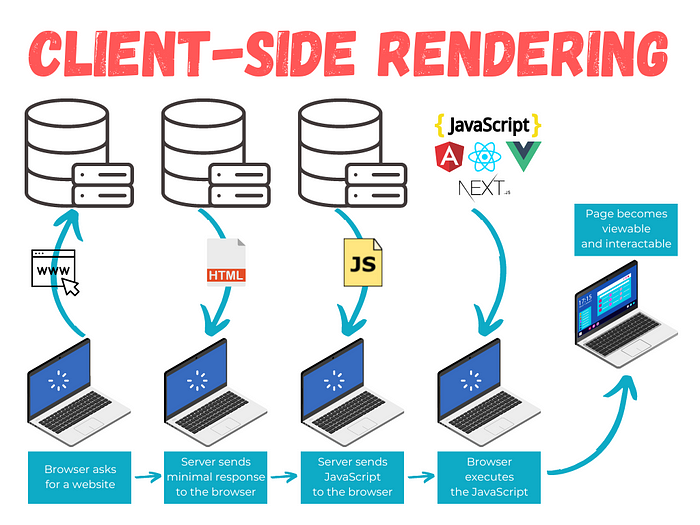

# taylor-swift

## Taylor Swift

### Introduction

[https://github.com/vietphan1995/taylor-swift.git](https://github.com/vietphan1995/taylor-swift.git)

Taylor Swift is a development software as browser code editor, this editor supports experience many programming languages on browser.

Taylor Swift create opportunity for developer from other programming languages out of javascript can experience on browser like document DOM manipulate, algorithm/function testing, user interface testing … while existing console window which supports pure javascript and real time return context.

Taylor Swift develops and researchs from interpreter to compiler editor for many purposes on browser database, browser environment, browser application.

https://forums.swift.org/t/introducing-swift-dom-a-cross-platform-html-and-svg-dsl/71407

[https://github.com/tayloraswift/swift-dom](https://github.com/tayloraswift/swift-dom)

Taylor Swift increases solution, idea project by provide ways for developer or other to experience and implement.

### [back to git projects …](https://github.com/vietphan1995/projects)

### Notes
https://phantrungviet.notion.site/taylor-swift-1a75e832d6ee80ecb7f3ff46cd4157fc